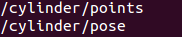

# Co4Robots MS1 NTUA Grasping Package

## Description:
In this ROS package the appropriate scripts are included corresponding to MS1 demo.
Specifically, an integration scheme for robot grasping using existing ROS modules is provided from NTUA CSL Team. The ROS packages which are used are:

1. [**MoveIt Framework**](http://moveit.ros.org/)
	
2. [**Move Base Planner**](http://wiki.ros.org/move_base)
	
3. [**Object Recognition Kitchen**](http://wg-perception.github.io/object_recognition_core/)
	
4. [**Tiago Robot Simulation Packages**](http://wiki.ros.org/Robots/TIAGo)

In this [link](https://c4r.pal-robotics.com:8080/share/s/oIypXZSDSq6_TWvMDBmBJw), you can watch the relative video that presents the preliminary simulation results of the described scheme. 


________________________________________________________________________________________________________________


## Dependences - Installing
The package dependeces are:

* **MoveIt**:

    ```sudo apt-get install ros-indigo-moveit```

    For more details refer to [MoveIt Installation Instructions](http://moveit.ros.org/install/).

* **Tiago Robot Simulation Packages**:

     Follow the instractions [here](http://wiki.ros.org/Robots/TIAGo/Tutorials/Installation/TiagoSimulation) in order to install the required packages for Tiago Simulation.
     **_Important Note_:** When the Tiago Simulation packages are install, the following changes should be done in the ```sensors_rgbd.yaml```, which is located inside the  ```tiago_moveit_config/config``` folder, for the simulation purposes:
    
    ```XML
    #sensors:
      #  - sensor_plugin: occupancy_map_monitor/PointCloudOctomapUpdater
      #    point_cloud_topic: /xtion/depth_registered/points
      #    max_range: 5.0
      #    point_subsample: 1
      #    padding_offset: 0.1
      #    padding_scale: 1.0
      #    filtered_cloud_topic: filtered_cloud

    # NTUA modified
    sensors:
      sensor_plugin: occupancy_map_monitor/PointCloudOctomapUpdater
      point_cloud_topic: /robot_0/xtion/depth_registered/points
      max_range: 2.0
      point_subsample: 1
      padding_offset: 0.1
      padding_scale: 1.0
      filtered_cloud_topic: filtered_cloud
    ```

* **Object Recognition Kitchen**:

    Installation instructions are described in this [page](http://wg-perception.github.io/object_recognition_core/install.html).

* **pykdl_utils**:

    Kinematics and geotry utilities for KDL. See the realive Documentation [here](http://wiki.ros.org/pykdl_utils).
    To install just clone the repository in the **tiago_public_ws** workspace and build it:
    
    ```cd ~/tiago_public_ws/src && git clone https://github.com/gt-ros-pkg/hrl-kdl```
    
    ```cd .. && catkin_make```

* **ms1_grasping**:

    Clone this package inside the tiago_public_ws workspace and build it!

    ```cd ~/tiago_public_ws && catkin_make```

________________________________________________________________________________________________________________

## Create The Object Recognition DB
If the ORK algorithms are used for object recognition, a database, which contains the objects, models and training data, should be created. 
To properly create and configure this database, the instruction described in this [link](http://wg-perception.github.io/object_recognition_core/infrastructure/couch.html#object-recognition-core-db) should be followed.

When the database is created, we should store the desired objects in the db in order that ORK recognize them. Steps:

1. **Creatin an Object in the DB**

    `rosrun object_recognition_core object_add.py -n cylinder -d "A cylinder" --commit`

2. **Adding a Mesh for the Object**

    ```rosrun object_recognition_core mesh_add.py YOUR_OBJECT_ID `rospack find ms1_grasping`/data/cylinder_5_5_20/cylinder_5_5_20.stl --commit```

3. **Visualizing Objects (_Optionally_)**

    If you want to visualize the object in the db click [here](http://localhost:5984/or_web_ui/_design/viewer/meshes.html)

4. **Deleting an Object (_Optionally_)**

     `rosrun object_recognition_core object_delete.py OBJECT_ID`

________________________________________________________________________________________________________________

## Running The Algorithm

To run and test the algorithm you should follow the following steps:

1. **Start Simulation Environment** of the demo corresponding to Milestone 1:

    `roslaunch c4r_simulation simulate_scenario.launch scenario:=ms1_demo rviz:=ms1_ntua`

2. Bring Up the **Object Detection Algorithm**, **Object Recognized Publisher** and **Move To Table Nodes**:

    `roslaunch ms1_grasping move_to_table.launch`

      **_Important Note_:** Replace the default value of the ```id``` argument in the ```move_to_table.launch``` file with the one which corresponds to the object created in **your CouchDB database**!!!

      ```XML
      <launch>
	    <!-- Object Id In CouchDB -->
	    <arg name="id" default="4e37b85ae1a07dcb5243ee571d00841f"/>
      ```
      
     When the above nodes are launched, the Tiago robot goes close to the table and detects the object (cylinder). Then, the object_recognized_publisher node  broadcasts the cylinder pose to ```tf``` and publishes its pose and point cloud using the following topics:

    


3. **Open the Gripper** and **Move It Close to the Object** using MoveIt algorithm:

    `roslaunch ms1_grasping reaching_to_grasp.launch`
    
    When The goal is achieved the gripper closes.


4. **Control Gripper Fingers (_Optionally_)**:

    `roslaunch ms1_grasping tiago_gripper_control.launch`
    
________________________________________________________________________________________________________________

## Interface Explanation

* **Interface With KTH**

1. The navigation controller (currently using ```move_base```) wait until the KTH planner publishes a goal pose in the relative topic and provides the status of the goal poses.
   The topics subscribed and published are described bellow:
   * _Subscribing_:
       `move_base/goal`    (Msg Type: [move_base_msgs/MoveBaseActionGoal](http://docs.ros.org/fuerte/api/move_base_msgs/html/msg/MoveBaseActionGoal).
       
           Wait until the KTH publish a goal pose to the topic.
   * _Publishing_:
       `move_base/result`    (Msg Type: [move_base_msgs/MoveBaseActionResult](http://docs.ros.org/fuerte/api/move_base_msgs/html/msg/MoveBaseActionResult.html))
       
       It provides status information about the goals that are sent to the controller. Status message definition can be found [here](http://docs.ros.org/fuerte/api/actionlib_msgs/html/msg/GoalStatus.html).
       **If the NTUA navigation algorithm is used, the corresponding msgs will be adapted accordingly to the ```move_base``` ones.**
       
       
2. When the KTH planner sends the word message that corresponds to grasp to the relative topic, for example **_graspit_**, the ```grasping algorithm``` begins. 
   The topics which relates with KTH planner are:
   * _Subscribing_:
       `/action/id`     (Msg Type:`StringStamped`)
   * _Publishing_:
       `/action/result`    (Msg Type: `StringStamped`)
   
   
    **Algorithm Architecture Example** :
   
    ```python
    class GraspingClass: 
     
     def __init__(self):
       
       # Subscribers
       rospy.Subcriber("/object/pose", PointStamped, self.GetObjecPose)
       rospy.Subscriber("/objec/points", PointCloud2, self.GetobjecPoints)
       rospy.Subscriber("/robot_0/action/id", StringStamped, self.ActionListener)
       
       # Publisher
       self.ResultPublisher = rospy.Publisher("/robot_0/action/result",StringStamped, queue_size = 10)
       
       # Initialize Variables
       self.points = PointCloud2()
       self.object_pose = PoseStamped()
       self.object_points = PointCloud2()
       
     def ActionListener(self,msg):
       if (msg.data == "graspit"):
         self.Grasping_Scheme()
       
     def GetobjecPoints(self,self.object_points)
     
     def GetobjecPose(self,self.object_pose)
     
     def Grasping_Scheme(self):
     
       areas_pose = self.Compute_Grasping_Areas()
       result = self.Grasp_Object(areas_pose)
     
       msg = StringStamped()
       msg.header.stamp = rospy.get_time()
       msg.data = result
     
       self.ResultPublisher.publish(msg)
     
     def Compute_Grasping_Areas(self)
   
     def Grasp_Object(self,data)
   # End of Class
   
    if __name__ =='__main__':
      try:
       rospy.init_node('grasping_scheme', anonymous=True)
       
       rate = rospy.Rate(10)
       grsp = GraspingClass()
       
       while not rospy.is_shutdown():
         rate.sleep()
       rospy.spin()
      except rospy.ROSInterruptException: pass
    ```


3. ```Leader Follower Scheme``` for the object cooperative transportation architecture will be designed similar to the grasping algorithm one. 
   
   The topics which relates with KTH planner will be:
   * _Subscribing_:
       `/action/id`    (Msg Type:`StringStamped`)
   * _Publishing_:
       `/action/result`    (Msg Type: `StringStamped`)
   
   When the message of `/action/id` is, for example **_col_transp_**, the controller is activated. The `/action/result` msg value depends on the process state.


* **Interface With FORTH**

1. The ```grasping algorithm``` uses the partial point cloud of the object (the points of the raw point cloud that relate to the object) and its pose. 
   * Subscribing topics:
   
   ```python
   rospy.Subcriber("/object/pose", PointStamped, self.GetObjecPose)
   rospy.Subscriber("/objec/points", PointCloud2, self.GetobjecPoints)
   ```
   
   Information of the **object mesh** may be needed too!

The **human pose** may be needed in **cooperative transportation scheme** but for now it is not used.


* **Interface With PAL**

1. A force torque sensor mounted on the wrist should feed the cooperative transportation control scheme with the appropriate data.
  * _Subscribing topics_:
  
  ```python
  rospy.Subcriber("/ft_sensor", WrenchStamped, self.GetEEWrench)
  ```
  
________________________________________________________________________________________________________________


## Component Interface Diagram

